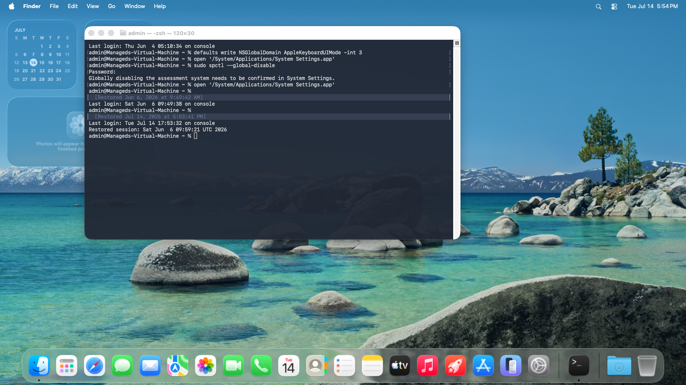
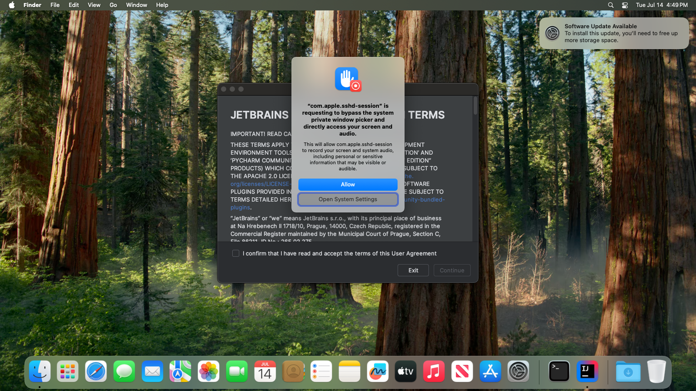

# tart-skills

**Agent skills for running GUI tests inside a [Tart](https://tart.run/) macOS VM — driven from Linux over SSH.**

The goal: give an AI agent (running on Linux, or anywhere without Apple Silicon)
a set of workable [skills](https://docs.claude.com/en/docs/claude-code/skills)
to boot a **full-GUI macOS session** in a Tart VM and *drive its UI* — take
screenshots, launch IntelliJ IDEA, click and type, and record video — so it can
run **GUI tests on macOS** without a Mac of its own.



> *Above: a real screenshot the agent captured over SSH from a headless
> (`--no-graphics`) Tart VM — a complete macOS Aqua session (Finder, Dock,
> wallpaper), not a headless server. This is what makes GUI testing possible.*

## Why this exists

[Tart](https://tart.run/) runs macOS/Linux VMs on Apple Silicon using Apple's
`Virtualization.Framework`. It only runs on an Apple Silicon Mac. An agent that
lives on Linux therefore cannot call `tart` directly — it has to reach a Mac.

`tart-skills` closes that gap with **one SSH hop to a Mac host** plus a small
orchestrator (`tart-remote`) installed there. The agent stays on Linux; all the
Mac- and VM-specific machinery lives behind a clean SSH seam.

```
┌────────────────┐   ssh    ┌──────────────────────────┐    ssh   ┌─────────────────────┐
│  Linux agent   │ ───────▶ │  Mac host (Apple Silicon) │   mux    │  macOS GUI VM       │
│  (the skills)  │          │  bin/tart-remote + tart   │ ───────▶ │  Aqua session:      │
│                │ ◀─────── │  (boots + supervises VM)  │          │  IntelliJ, Finder…  │
└────────────────┘  stdout  └──────────────────────────┘          └─────────────────────┘
     PNG / MP4 / IP            the "management service"          screencapture / cliclick
```

Two SSH hops:

1. **Outer (Linux → Mac):** the agent runs `ssh $MAC_USER@$MAC_HOST 'tart-remote …'`.
2. **Inner (Mac → VM guest):** `tart-remote` reaches the guest with `admin`/`admin`
   over a multiplexed SSH connection (password via `sshpass`, or `SSH_ASKPASS` if
   `sshpass` isn't installed).

## The management layer (the "service")

A Tart VM is a long-lived foreground process (`tart run`). If an agent just SSHed
in and ran it, the VM would die the moment the SSH command returned. `tart-remote`
treats the VM as a **supervised resource**:

- **`vm-up`** boots it *detached* (`nohup … </dev/null & disown`), so the VM — and
  its GUI session — keeps running after the agent's SSH connection closes.
- State is read straight from Tart (`tart list` / `tart ip`) — no extra bookkeeping.
- The inner SSH connection is multiplexed with `ControlMaster`/`ControlPersist`,
  which avoids macOS sshd's "Too many authentication failures" lockout under the
  rapid connections a driving session makes.

For setups that must survive a host reboot, wrap `tart-remote vm-up` in a
launchd LaunchAgent on the Mac — the orchestrator is designed to be called that
way too (idempotent `vm-up`).

## Skills

Each lives in `skills/<name>/SKILL.md`:

| Skill | Use it to… |
|---|---|
| **[tart-remote-setup](skills/tart-remote-setup/SKILL.md)** | Establish the Linux→Mac SSH hop, install `tart-remote`, verify Tart. **Run first.** |
| **[tart-vm-manage](skills/tart-vm-manage/SKILL.md)** | Create / boot (detached) / provision / status / stop / delete the VM. |
| **[tart-vm-screenshot](skills/tart-vm-screenshot/SKILL.md)** | Capture the VM screen as a PNG — the agent's "eyes". |
| **[tart-vm-intellij](skills/tart-vm-intellij/SKILL.md)** | Launch IntelliJ IDEA (via [devrig](https://devrig.dev)), open a project, click/type to drive it. |
| **[tart-vm-video](skills/tart-vm-video/SKILL.md)** | Record the GUI as video (`.mov` → compact `.mp4`). |
| **[tart-vm-cache](skills/tart-vm-cache/SKILL.md)** | Share ONE copy of the IDE binaries across all VMs (host cache) — faster, less disk. Manages IDEs with [devrig](https://devrig.dev). |

## Sharing the Mac across tasks

The Mac host is shared — many agents/tasks use it at once. The skills bake in
etiquette so they don't step on each other:

- **Unique VM per task** (`TART_VM=tart-skills-<task-id>`); `tart-remote ls`
  shows all VMs — only touch your own.
- **Always clean up** (`vm-gc`) when done, even on failure.
- **Size modestly** so neighbors keep headroom.

## IDE management & caching

- **[devrig](https://devrig.dev)** is the recommended tool to download, install,
  and start JetBrains IDEs for the agent (`devrig backend download/start
  idea-community`). See **tart-vm-intellij** and **tart-vm-cache**.
- **Shared IDE cache:** one copy of the IDE binaries lives in a host folder
  (`~/tart-skills-cache`), mounted read-only into every VM — no per-VM download,
  no per-VM disk copy. `tart-remote cache-setup` populates it; `vm-up` mounts it;
  the IDE runs straight from the mount. See **tart-vm-cache**.

```bash
ssh "$MAC" '~/bin/tart-remote cache-setup'    # one-time: fetch IntelliJ IDEA Community Edition into the shared host cache
ssh "$MAC" '~/bin/tart-remote cache-status'   # what's cached + size
```

Moving files in and out of the guest:

```bash
ssh "$MAC" "$V ~/bin/tart-remote push ./project /Users/admin/Work/project"   # host  -> guest
ssh "$MAC" "$V ~/bin/tart-remote pull /Users/admin/out.log ./out.log"        # guest -> host
```

## Prerequisites

**On the Mac host** (the one you SSH into):

- Apple Silicon (M1 or newer) Mac.
- **Tart** — either `brew install cirruslabs/cli/tart`, or **brew-less** (no
  Xcode Command Line Tools required), which is what a bare macOS host needs:
  ```bash
  mkdir -p ~/bin ~/tart
  curl -fsSL https://github.com/cirruslabs/tart/releases/latest/download/tart.tar.gz -o /tmp/tart.tar.gz
  tar xzf /tmp/tart.tar.gz -C ~/tart
  ln -sf ~/tart/tart.app/Contents/MacOS/tart ~/bin/tart
  ```
- `sshpass` is **optional**: if absent, `tart-remote` uses OpenSSH's
  `SSH_ASKPASS` for the inner hop. So `tart` + stock `ssh` are the only hard
  dependencies — **no Homebrew required on the Mac**.
- **Remote Login** enabled: System Settings → General → Sharing → Remote Login,
  or `sudo systemsetup -setremotelogin on`.

**On the agent side (Linux):** an SSH client and SSH access to the Mac.

Everything the guest needs (cliclick, ffmpeg, IntelliJ, the screen-recording
grant) is installed by `tart-remote provision`.

### Configure the Mac host (one-time)

On the Apple Silicon Mac you will drive:

1. **Enable Remote Login (SSH):**
   ```bash
   sudo systemsetup -setremotelogin on
   ```
   (or System Settings → General → Sharing → Remote Login).
2. **Give the agent key-based SSH access.** From the agent machine, install your
   public key on the Mac (avoids passwords and keeps sessions unattended):
   ```bash
   ssh-copy-id "$MAC_USER@$MAC_HOST"
   # or append your public key to ~/.ssh/authorized_keys on the Mac by hand
   ssh "$MAC_USER@$MAC_HOST" 'echo ok'     # verify
   ```
   Tip: if your agent offers many keys (e.g. an SSH agent), pin the right one
   with `IdentitiesOnly yes` + `IdentityFile` in `~/.ssh/config`, and add
   `ControlMaster auto` / `ControlPersist` so repeated commands reuse one
   authenticated connection.
3. **Install Tart** (brew or brew-less — see above). No Homebrew, no Xcode
   Command Line Tools, and no other packages are required on the Mac.
4. **(Dedicated hosts) Enable GUI auto-login as a startup action.** macOS guests
   need an unlocked `login.keychain`, which a headless-rebooted Mac does not
   have until someone logs in at the console. For an always-on automation host,
   make it auto-login a GUI user at every boot — the keychain is then unlocked
   automatically and VM boots just work (no `Code=-9`). See
   **[docs/host-autologin.md](docs/host-autologin.md)**. The per-session
   alternative is `TART_KEYCHAIN_PW` (below).

## Quick start

```bash
# 0. from the agent, point at your Mac + pick a UNIQUE VM name for this task
#    (the Mac is shared — a unique name keeps you from clobbering other tasks)
MAC=me@my-mac.local          # MAC_USER@MAC_HOST
export V="TART_VM=tart-skills-demo42"    # your task-unique name, passed on every call

# 1. install the orchestrator on the Mac (from this repo checkout)
ssh "$MAC" 'mkdir -p ~/bin ~/tart-skills/provision'
scp bin/tart-remote            "$MAC":~/bin/tart-remote
scp provision/provision.sh     "$MAC":~/tart-skills/provision/provision.sh
ssh "$MAC" 'chmod +x ~/bin/tart-remote ~/tart-skills/provision/provision.sh'

# 2. boot a full-GUI macOS VM (first run pulls the base image — minutes).
#    On a headless macOS 15+ host add TART_KEYCHAIN_PW=... (see notes).
ssh "$MAC" "$V ~/bin/tart-remote vm-up"          # prints the VM IP

# 3. provision it once (cliclick, ffmpeg, IntelliJ CE, screen-recording grant)
ssh "$MAC" "$V ~/bin/tart-remote provision"

# 4. SEE the GUI
ssh "$MAC" "$V ~/bin/tart-remote screenshot -" > desktop.png

# 5. launch IntelliJ and watch it come up
ssh "$MAC" "$V ~/bin/tart-remote start-ide"
sleep 25
ssh "$MAC" "$V ~/bin/tart-remote screenshot -" > ide.png

# 6. drive the GUI: click / type
ssh "$MAC" "$V ~/bin/tart-remote click 800 450"
ssh "$MAC" "$V ~/bin/tart-remote type 'hello'"

# 7. record a short video of the GUI
ssh "$MAC" "$V ~/bin/tart-remote record 15 -" > clip.mov

# 8. ALWAYS clean up your VM when done (even on failure)
ssh "$MAC" "$V ~/bin/tart-remote vm-gc"          # stop + delete YOUR VM
```



> *Above: the Welcome screen after `start-ide` — the agent walked the first-run
> dialogs itself: ticked the JetBrains User Agreement checkbox, clicked Continue,
> dismissed Data Sharing and the local-network prompt, and cleared a macOS
> screen-recording consent along the way (provisioning de-quarantines the app, so
> no Gatekeeper prompt) — all driven over SSH from a separate machine acting as
> the agent. See the walkthrough in `skills/tart-vm-intellij`.*

## `tart-remote` command reference

```
Lifecycle (management "service"):
  vm-create            clone $TART_IMAGE into the VM (no-op if it exists)
  vm-up                configure + boot detached (survives SSH close) + wait for IP
  vm-ip                print the VM IP
  vm-status            exists / running / ip / provisioned
  vm-down              stop the VM (keeps the disk)
  vm-gc                stop + delete the VM
  vm-list | ls         list ALL tart VMs on this host (only touch your own)
  provision            copy + run provision.sh in the guest

Shared host cache (one IDE copy for all VMs — faster, less disk):
  cache-setup          download IntelliJ IDEA Community Edition into $TART_CACHE_DIR once (on the host)
  cache-status         show what the shared cache holds

Drive the GUI:
  guest [cmd...]       run a command in the guest (interactive shell if none)
  screenshot [OUT]     capture the screen; OUT path on host, or '-'/omitted = PNG to stdout
  record SECS [OUT]    record SECS of video; OUT on host, or '-' = raw .mov to stdout
  start-ide [PROJECT]  launch IntelliJ (open PROJECT if given)
  click X Y            move + click at guest screen coords (integers)
  type TEXT            type any text into the focused field
  key K                cliclick key command, e.g. "kp:return" or a combo "kd:cmd kp:space ku:cmd"
  pull REMOTE LOCAL    copy a file/dir OUT of the guest to the host
  push LOCAL REMOTE    copy a file/dir INTO the guest from the host
```

Configuration via environment (prefix on the remote side, keep consistent across calls):

| Env | Default | Meaning |
|---|---|---|
| `TART_VM` | `tart-skills-vm` | VM name |
| `TART_IMAGE` | `ghcr.io/cirruslabs/macos-tahoe-base:latest` | base image (macOS 26; `…-sequoia-base` = macOS 15) |
| `TART_CPU` | `4` | vCPUs |
| `TART_MEMORY` | `8192` | RAM (MiB) |
| `TART_DISPLAY` | `1600x900` | logical resolution (also the screenshot/video size) |
| `TART_USER` / `TART_PASS` | `admin` / `admin` | guest SSH credentials |
| `TART_DIR` | — | share a host dir into the guest: `name:/host/path[:ro]` |
| `TART_CACHE_DIR` | `~/tart-skills-cache` | host folder holding the shared IDE copy, mounted read-only into every VM |
| `TART_KEYCHAIN_PW` | — | Mac host user's **login** password; `vm-up` unlocks `login.keychain` with it (required for macOS guests on a headless macOS 15+ host — see notes) |

## How it works — design notes

- **Full GUI, headless host.** The VM boots `--no-graphics` (no window on the
  Mac), but Tart's base images auto-log-in `admin` into a complete Aqua session
  with `WindowServer`. `screencapture` and `cliclick` over SSH drive *that*
  session — which is exactly what GUI testing needs. To *watch* it live from a
  Mac: `tart run --vnc-experimental`.
- **Screen-recording grant.** An SSH session can't capture the screen until
  `kTCCServiceScreenCapture` is granted to `com.apple.sshd-session`. Tart's
  cirruslabs base images ship with SIP **off**, so `provision.sh` writes that
  grant directly into `TCC.db`. *(On macOS 15+/26 a periodic "bypass the private
  window picker" consent dialog also appears; captures still succeed, and the
  agent can clear the dialog with a `click` — see the screenshot skill.)*
- **Gatekeeper.** A cask-installed app is quarantined; the first `open` pops a
  "downloaded from the Internet" dialog. Provisioning strips
  `com.apple.quarantine` so `start-ide` opens straight into the IDE.
- **macOS guests need an unlocked login.keychain (macOS 15+).** Apple's
  Virtualization.framework refuses to boot a *macOS* guest if the host's
  `login.keychain` is locked, failing with a misleading `Code=-9` security
  error ("Failed to create new HostKey"). A headless SSH session leaves it
  locked. Set `TART_KEYCHAIN_PW` so `vm-up` runs `security unlock-keychain`
  first — or, on a dedicated host, enable GUI auto-login so a real login
  session keeps the keychain unlocked at every boot
  (**[docs/host-autologin.md](docs/host-autologin.md)** — note that
  `sysadminctl -autologin` fails over headless SSH, so that guide sets it up the
  manual way). Linux guests are unaffected. (See the
  [tart FAQ](https://tart.run/faq/) and
  [cirruslabs/tart#1146](https://github.com/cirruslabs/tart/issues/1146).)
- **`open -a`, not a bare launch.** A Java GUI app launched directly from an SSH
  shell dies with `HeadlessException`; `open -a` routes through launchd into the
  GUI session so windows render.
- **PATH.** A non-interactive SSH command sources only `~/.zshenv`, not
  `~/.zprofile` — so Homebrew's `/opt/homebrew/bin` (cliclick, ffmpeg) is off
  PATH by default. Provisioning adds brew to `~/.zshenv` and `tart-remote`
  prefixes a PATH export on every guest command.
- **stdout is data, stderr is logs.** `screenshot -`, `record N -`, and `vm-ip`
  emit clean bytes to stdout so you can redirect straight to a file.
- **No Homebrew required on the Mac.** `tart` installs as a standalone binary,
  and the inner-hop password auth uses `sshpass` *if present* or falls back to
  OpenSSH's `SSH_ASKPASS` (`SSH_ASKPASS_REQUIRE=force`, no tty needed) — so a
  bare macOS host with only Tart + stock `ssh` works.

Many of these lessons were distilled from a prior video-production project that
drove Tart VMs the hard way; this repo generalizes the durable ones into a
minimal, GUI-testing-focused toolkit.

## Testing

This was validated **end-to-end over both SSH hops** against a real remote
Apple Silicon Mac, driven from a separate machine acting as the agent — with no
Homebrew on the Mac (Tart installed brew-less, inner hop via `SSH_ASKPASS`):

- `vm-create` (pull macOS 26 base) → `vm-up` (keychain-unlocked, detached boot)
- `provision` (cliclick, ffmpeg, IntelliJ IDEA Community Edition, TCC grant,
  de-quarantine, display pinned to 1600x900)
- `screenshot -` → real desktop PNG (both images above are genuine captures)
- `start-ide` → IntelliJ launched, no Gatekeeper prompt
- `click` → walked the first-run dialogs to the **Welcome screen**: cleared the
  macOS screen-recording consent, accepted the JetBrains User Agreement
  (checkbox + Continue), dismissed Data Sharing and the local-network prompt
- `record 8 -` → valid 1600×900 QuickTime video

The screenshots above were streamed straight through both hops to the agent.

## License

[MIT](LICENSE) © 2026 Eugene Petrenko ([jonnyzzz](https://github.com/jonnyzzz))
